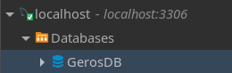
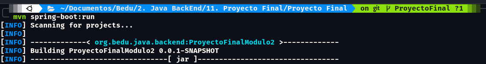
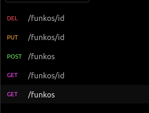

# Proyecto Final Módulo 2 Java BE I

***
+ **Primero crear una base de datos en MySql con el nombre: `GerosBD`**

	

+ Ejecutar en consola con el comando (con maven instalado) : `mvn spring-boot:run`

	

+ Probar los endpoint iniciando con `localhost:8080/` y los siguientes request:

	