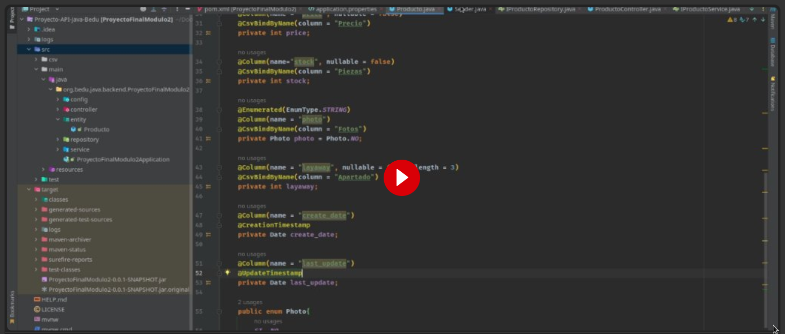

# Proyecto Final Módulo 2 Java BE I

***
+ **Primero crear una base de datos en MySql con el nombre: `GerosBD`**

	

+ Ejecutar en consola con el comando (con maven instalado) : `mvn spring-boot:run`

	

+ Probar los endpoint iniciando con `localhost:8080/` y los siguientes request:

 	_Cambiar `id` por el número de id del producto a modificar_
	
	Ejemplo: `localhost:8080/funkos/15`

	

+ Video de presentación del proyecto:
	
	
