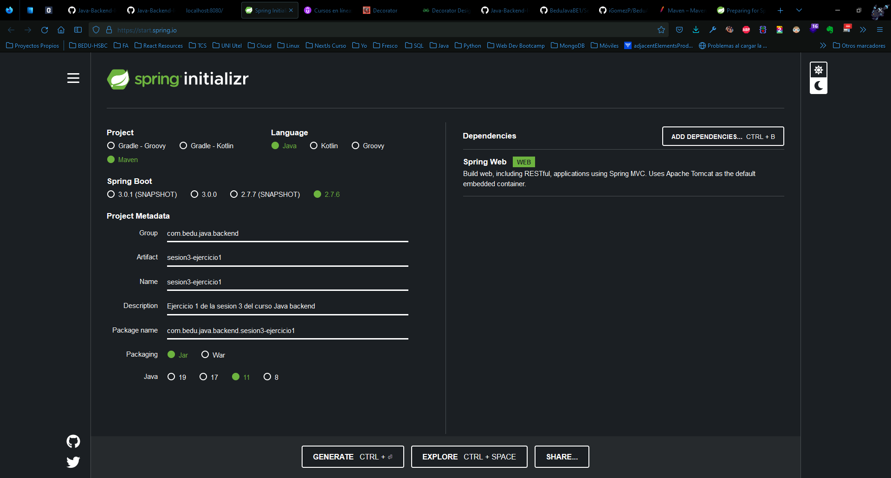
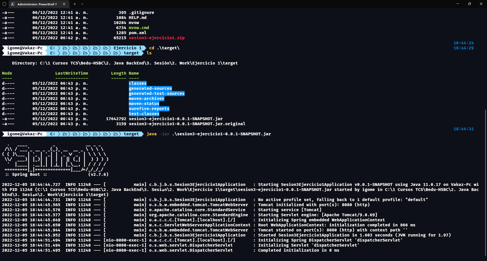
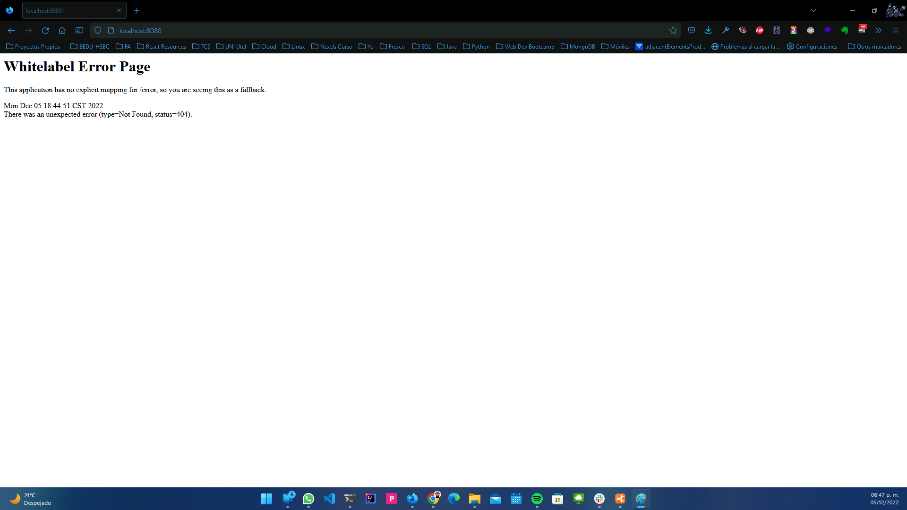

## Ejemplo 01: Proyecto Maven con Spring Initializr

### OBJETIVO

- Crear un proyecto Maven usando Spring Initializr.
- Compilar, empaquetar y ejecutar la aplicación o proyecto generados desde la línea de comandos.

### DESARROLLO

Spring Initializr es un portal que se encarga de generar, de forma automática, los archivos necesarios para iniciar un proyecto Spring Boot. A través de este portal puedes seleccionar diferentes opciones como la versión de Java con la que desarrollarás tu proyecto, la herramienta de gestión del proyecto (Maven o Maven), y los módulos o librerias que usarás.

Su objetivo es ayudarnos a generar esa estructura inicial del proyecto de una forma fácil y rápida para que podamos comenzar el desarrollo en el menor tiempo posible, teniendo la confianza de que contamos con una estructura correcta.

