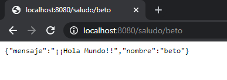
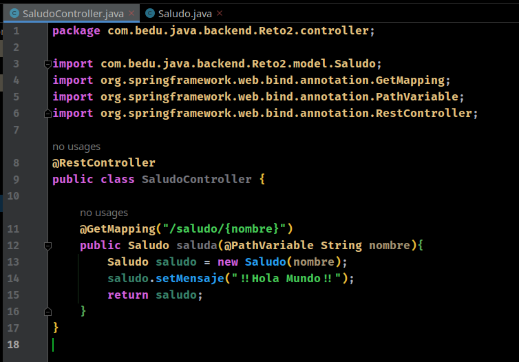
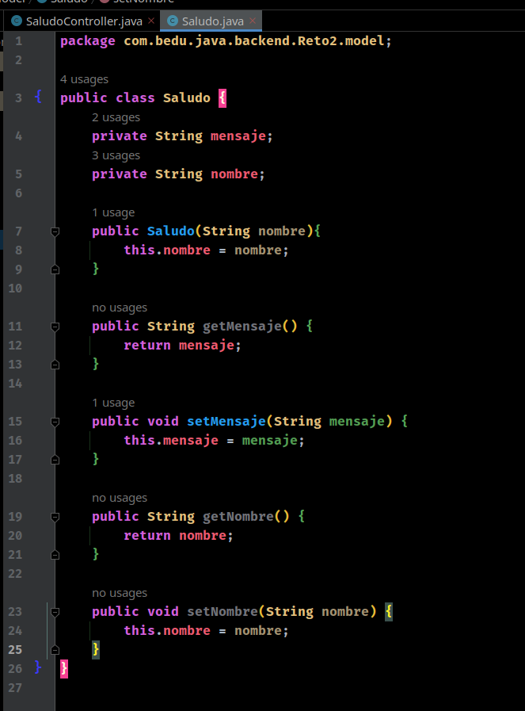
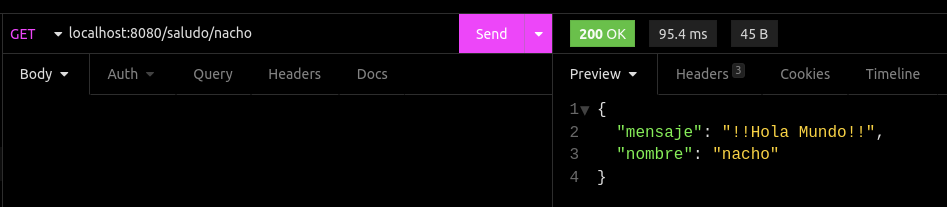

## Reto 02: Controladores con Spring MVC con parámetros

### OBJETIVO

- Aprender la forma de crear controladores de Spring usando su módulo web (Spring MVC) y recibir un parámetro.
- Crear un servicio REST que regrese un recurso dinámico.
- Consumir el servicio usando un navegador Web y con Postman.

### DESARROLLO

En el ejemplo anterior creamos un controlador que regresaba un mensaje estático predeterminado, lo que quiere decir que no importa cuantas veces llamemos al recurso siempre recibimos la misma respuesta. 

En este reto tendrás que modificar el controlador creado en el ejemplo anterior para que reciba un parámetro que interpretará como el nombre de la persona a la que estamos saludando. El objetivo es poder saludar a un usuario usando su nombre, por lo que la salida deberá ser similar a la siguiente:

***

## RESULTADO:

1. Modificar el controlador y el modelo creados en el ejemplo anterior para que reciba un parámetro que interpretará como el nombre de la persona a la que estamos saludando:

		
SaludoController.java

	
	
	

	
 
		
 Saludo.java 

	
	
	

2. Deberás validar el correcto funcionamiento de la aplicación usando la herramienta Postman y desde el navegador:
	

		
 Resultado de Insomnia (alternativa a Postman) 

	
	
	

