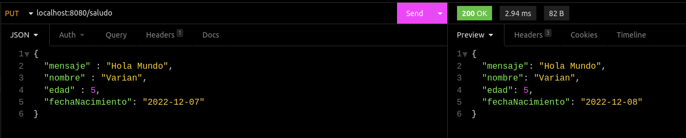

## Reto 03: Controladores PUT para actualización de información

### OBJETIVO

- Aprender la forma de crear manejadores de peiticiones para actualizar información.
- Manejar parámetros relacionados con fechas.
- Consumir el servicio usando un navegador Web y con Postman.


### DESARROLLO

En el ejemplo anterior creamos un controlador que recibía un parámetro en el cuerpo de la petición a través de un manejador **POST**. Para este reto deberás realizar una tarea similar, pero usando un método **PUT** y agregando un parámetro adicional en el cuerpo de la petición. Este parámetro será una fecha la cual deberás sumarle un día y regresarla como respuesta de la petición. Eso quiere decir que si envias como parámetro el 1 de noviembre del 2023, deberás obtener den la respuesta el 2 de noviembre del 2023.

Seguiremos usando la clase `Saludo` con la que hemos trabajado toda esta sesión, pero le agregaremos este nuevo parámetro, por lo que la clase deberá tener los siguientes parámetros:

```java
public class Saludo {
    private String mensaje;
    private String nombre;
    private int edad;
    private LocalDate fechaNacimiento;
}
```
Deberás validar el correcto funcionamiento de la aplicación usando la herramienta Postman y desde el navegador.

La salida debe ser como la siguiente:


***

## RESULTADO:

1. Deberás realizar una tarea similar, pero usando un método **PUT** y agregando un parámetro adicional en el cuerpo de la petición:
	<details>
		<summary>SaludoController.java</summary>
	
	```java
	package com.bedu.java.backend.Reto3.controller;

	import com.bedu.java.backend.Reto3.model.Saludo;
	import org.springframework.web.bind.annotation.PutMapping;
	import org.springframework.web.bind.annotation.RequestBody;
	import org.springframework.web.bind.annotation.RestController;

	@RestController
	public class SaludoController {

		@PutMapping("/saludo")
		public Saludo saluda(@RequestBody Saludo saludo){
			saludo.setFechaNacimiento(saludo.getFechaNacimiento().plusDays(1));
			return saludo;
		}
	}
	```
	</details>
	<details> 
		<summary> Saludo.java </summary>

	```java
	package com.bedu.java.backend.Reto3.model;
	
	import java.time.LocalDate;
	
	public class Saludo {
		private String mensaje;
		private String nombre;
		private int edad;
		private LocalDate fechaNacimiento;
	
		public String getMensaje() {
			return mensaje;
		}
	
		public void setMensaje(String mensaje) {
			this.mensaje = mensaje;
		}
	
		public String getNombre() {
			return nombre;
		}
	
		public void setNombre(String nombre) {
			this.nombre = nombre;
		}
	
		public int getEdad() {
			return edad;
		}
	
		public void setEdad(int edad) {
			this.edad = edad;
		}
	
		public LocalDate getFechaNacimiento() {
			return fechaNacimiento;
		}
	
		public void setFechaNacimiento(LocalDate fechaNacimiento) {
			this.fechaNacimiento = fechaNacimiento;
		}
	}	
	```
	</details>


2. Deberás validar que el parámetro enviado, en este caso una fecha deberá sumar un día y regresarla como respuesta de la petición:
	<details>
		<summary> Resultado de Insomnia (alternativa a Postman) </summary>
	
	
	</details>
