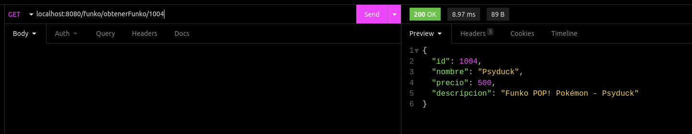

## Sesión 3: Introducción a Spring Boot

### :dart: OBJETIVO

- Estructura inicial del proyecto

### DESARROLLO

En esta sesión aprendimos qué es Spring Framework y cómo Spring Boot facilita aún más el desarrollo de aplicaciones backend.

Recuerda que todo lo trabajado en tu prework, así como durante la sesión, puede ser aplicado a tu proyecto personal. 

### Asegúrate de comprender:

1. Cómo utilizar el Spring Initializr para crear un proyecto
2. Cómo configurar un proyecto de Maven
3. Cómo crear un código base de Spring Boot


### Indicaciones generales
Para este postwork se generará el esqueleto inicial del proyecto que estaremos realizando a lo largo de estos dos módulos. Este proyecto es una API REST, por lo que los primeros pasos son definir la estructura inicial del proyecto. Es importante notar que los datos que se usan en el entregable de esta sesión son de prueba y sin persistencia ya que aún no contamos con una base de datos.
Deberás realizar las siguientes tareas:

- Generación del proyecto a partir de Spring initializr.
- Identificar las entidades presentes en tu proyecto (los actores de este, que eventualmente se convertirán en tablas en la base de datos)
- Creación de controladores siguiendo el patrón MVC para cada una de las entidades con los siguientes métodos:
   - Consulta de información 
   - Guardado de información
   - Actualización de información
   - Eliminación de la información

En cada controlador será necesario contar con una fuente de datos, como un arreglo que simule los registros de cada entidad para que este pueda fungir como Base de Datos temporal en el proyecto.

***

## RESULTADO:
Métodos implementados:

> ***Comando para correr el servidor con maven:*** 
>> `./mvnw spring-boot:run`
>
> Solo se incluyen fragmentos de las clases.

1. Consulta de información:
	<details>
	<summary> FunkoController.java</summary>
	
	```java
	@GetMapping("/obtenerFunkos")
	public List<ProductosFunko> obtenerFunkos(){
		return funkos;
	}

	@GetMapping("/obtenerFunko/{id}")
	public ProductosFunko obtenerFunko(@PathVariable Long id){
		// Usando Stream
		return funkos.stream().filter(funko -> funko.getId().equals(id)).findFirst().orElse(null);
	}
	```
	> Evidencia de Insomnia:
	
		
	
	</details>
	
2. Guardado de información:
	<details>
		<summary> FunkoController.java</summary>
		
	```java
	@PostMapping("/crearFunko")
	public ProductosFunko crearFunko(@RequestBody CrearFunko funko){
		ProductosFunko nuevoFunko = new ProductosFunko(++ultimoId, funko.getNombre(), funko.getPrecio(), funko.getDescripcion());
		funkos.add(nuevoFunko);
		return nuevoFunko;
	}
	```
	> Evidencia de Insomnia:
		
	
	
	</details>
	
3. Actualización de información:
	<details>
	<summary> FunkoController.java</summary>
	
	```java
	@PatchMapping("/modificarFunko/{id}")
	public ProductosFunko modificarFunko(@PathVariable Long id, @RequestBody CrearFunko funko){
		for (ProductosFunko f : funkos ){
			if (f.getId().equals(id)){
				ProductosFunko funkoModificado = new ProductosFunko(
						id,
						(funko.getNombre() == null || funko.getNombre().equals("")) ? f.getNombre() : funko.getNombre(),
						(funko.getPrecio() == 0) ? f.getPrecio() : funko.getPrecio(),
						(funko.getDescripcion() == null || funko.getNombre().equals("")) ? f.getDescripcion() : funko.getDescripcion());
				funkos.set(funkos.indexOf(f), funkoModificado);
				return funkoModificado;
			}
		}
		return null;
	}
	```
	> Evidencia de Insomnia:
		
	
	

	</details>
		
4. Eliminación de la información:
		<details>
	<summary> FunkoController.java</summary>
	
	```java
	@DeleteMapping("/borrarFunko/{id}")
	public List<ProductosFunko> borrarFunko (@PathVariable Long id){
		for (ProductosFunko f : funkos ){
			if (f.getId().equals(id)){
				funkos.remove(f);
				return funkos;
			}
		}
		return null;
	}
	```
			
	> Evidencia de Insomnia:
		
	
	
	
	</details>
			
| Requisito | Sí lo cumple | No lo cumple |
| --------- | ------------ | ------------ |
| A. Archivo de configuración pom.xml para compilar y ejecutar el programa | :heavy_check_mark: | |
| B. Uso del patrón MVC para la generación del proyecto | :heavy_check_mark: | |
| C. Presencia y correcto funcionamiento de todos los métodos definidos en los controladores del proyecto | :heavy_check_mark: | |
