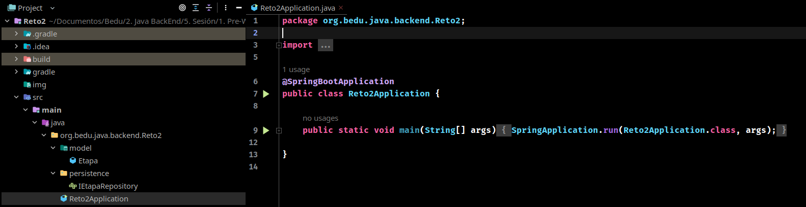
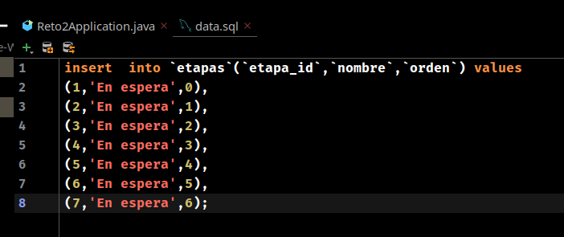
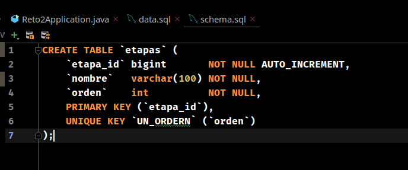
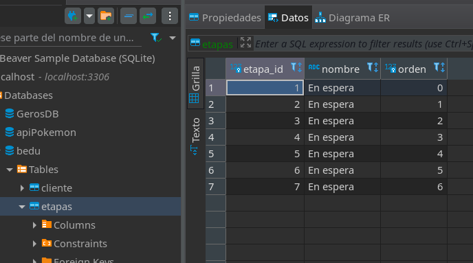
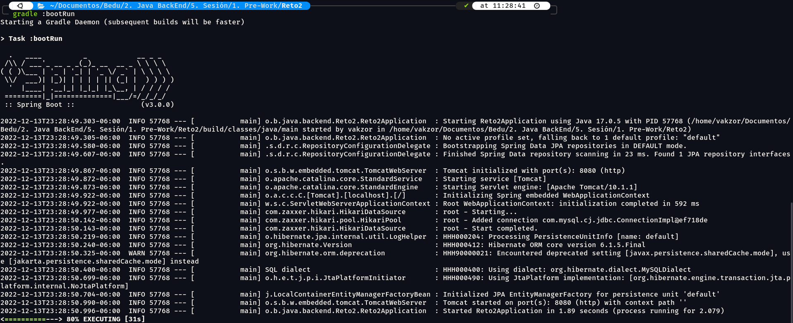

## Reto 02: Inicialización de datos con SQL

### OBJETIVO

- Aprovechar las capacidades de Spring Boot para ejecutar archivos SQL al momento de iniciar la aplicación.
- Inicializar valores de catálogos en base de datos.

### DESARROLLO

En el ejemplo anterior creamos una tabla e inicializamos el catálogo de `etapas` de la aplicación desde una clase que implementa la interface `CommandLineRunner`. Dentro de esta usamos la implementación de un repositorio de Spring Data JPA. Esta es una forma que tiene ventajas, pero no es la única forma de hacerlo cuando tenemos una aplicación creada con Spring Boot.

En este reto tendrás que eliminar la clase que implementa `CommandLineRunner` y lograr la creación de la tabla `etapas`, así como su inicialización. 

- Eliminar la clase que implementa `CommandLineRunner` :

- Deberás crear dos archivos `.sql` diferentes, uno con la estructura de la tabla y otro con los datos para inicializarla:

- Evidencia del resultado:

